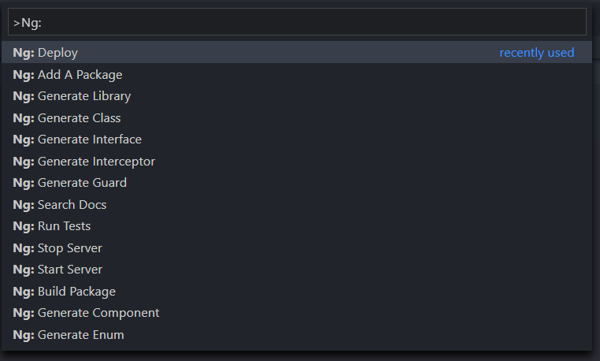

# Angular Ng

Run Angular Ng commands from within Visual Studio Code

## Features

* Generate files (Components, Directives, Services, etc.)
* Start/Stop a test server
* Run tests
* Search the documentation
* Add packages that support schematics
* Build
* Deploy



## Requirements

This package requires that the `@angular/cli` is installed globally

```
npm i -g @angular/cli
```

## Usage

Once you have installed the extension, it will become active once you open a workspace that has at least one `angular.json` file within the workspace. You can then open the command pallet, and start running the commands. Just type `Ng:` to get a list of commands.

Many commands have optional input questions, leave them blank to use the defaults, or enter your own value.